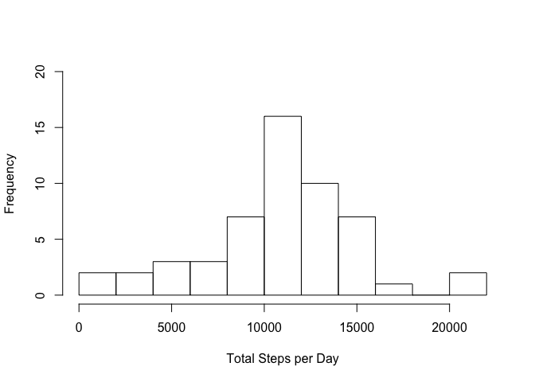
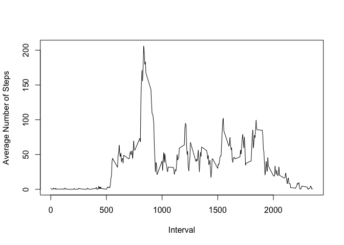
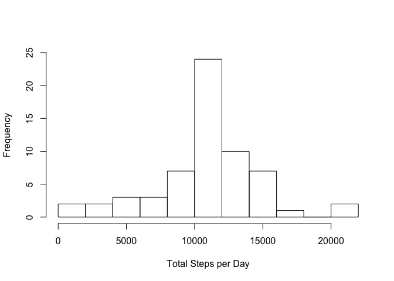
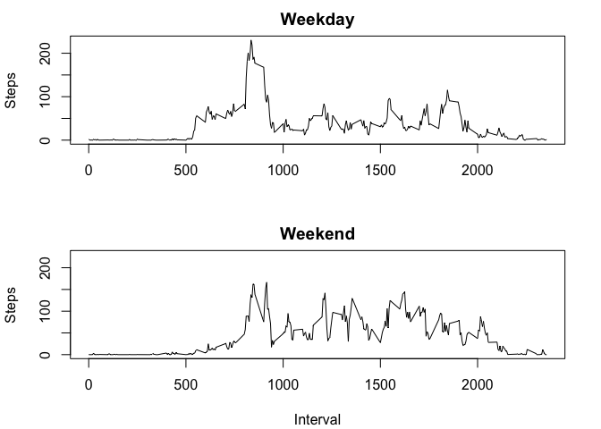

# Reproducible Research - Peer Assessment 1 <br><br>


## Loading and preprocessing the data  


```r
unzip("activity.zip")
df1 <- read.csv("activity.csv")
df1$date <- as.Date(df1$date, "%Y-%m-%d")
```
<br><br>

## What is mean total number of steps taken per day?  


```r
tSteps <- with(df1, tapply(steps, date, sum))
hist(tSteps, 15, main="", xlab="Total Steps per Day", ylim=c(0,20))
```

<!-- -->

```r
meanSteps <- mean(tSteps, na.rm=TRUE)
medSteps <- median(tSteps, na.rm=TRUE)
print(paste("The mean total number of steps per day is", meanSteps))
```

```
## [1] "The mean total number of steps per day is 10766.1886792453"
```

```r
print(paste("The median total number of steps per day is", medSteps))
```

```
## [1] "The median total number of steps per day is 10765"
```
<br><br>

## What is the average daily activity pattern?  


```r
avgD <- with(df1, tapply(steps, interval, mean, na.rm=TRUE))
intervals <- unique(df1$interval)
df2 <- data.frame(intervals, avgD)
with (df2, plot(intervals, avgD, type="l", xlab="Interval", ylab="Average Number of Steps"))
```

<!-- -->

```r
maxInt <- df2[which.max(df2$avgD),"intervals"]
print(paste("The interval containing the maximum number of steps is", maxInt))
```

```
## [1] "The interval containing the maximum number of steps is 835"
```
<br><br>

## Imputing missing values  


```r
mValues <- with(df1, sum(is.na(steps)))
print(paste("The total number of missing values is", mValues))
```

```
## [1] "The total number of missing values is 2304"
```


The mean of each 5-min interval was rounded and substituted in place of the missing values  

```r
library(data.table)
dfNew <- copy(df1)
mIndex <- which(is.na(df1$steps))
for (i in mIndex){
	missInt <- df1$interval[i]
	dfNew$steps[i] <- round(df2[df2$intervals==missInt, "avgD"])
}
newSteps <- with(dfNew, tapply(steps, date, sum))

hist(newSteps, 15, main="", xlab="Total Steps per Day", ylim=c(0,25))
```

<!-- -->

```r
print(paste("The mean total number of steps per day is", mean(newSteps)))
```

```
## [1] "The mean total number of steps per day is 10765.6393442623"
```

```r
print(paste("The median total number of steps per day is", median(newSteps)))
```

```
## [1] "The median total number of steps per day is 10762"
```
  
The impact of imputing missing values on the mean and median estimates was minimal 
(for e.g. the median was 10765 for the original data set and it was 10762 for the newer ones). 
The only difference was observed in the histogram of total daily steps. The frequency of the 
mean increased since all NAs were replaced by the mean.
<br><br>

## Are there differences in activity patterns between weekdays and weekends?  


*Create dataset with new factor variable with two levels: "weekday" and "weekend"*

```r
timeInt <- as.integer(levels(as.factor(dfNew$interval)))
timeInt <- format(timeInt, format="%H%M")
timeInt <- gsub(" ", "0", timeInt)
w <- weekdays(as.POSIXct(paste(dfNew$date, timeInt)))
wkday <- c("Monday",   "Tuesday",   "Wednesday", "Thursday",  "Friday")
wkend <- c("Saturday", "Sunday")
for (i in 1:length(w)){
	if (w[i] %in% wkday) { dfNew$day[i] <- "weekday" } 
		else if (w[i] %in% wkend) { dfNew$day[i] <- "weekend" }
}
dfNew$day <- as.factor(dfNew$day)
```
<br><br>
*Create panel plot to compare weekday and weekend activities*  


```r
sp <- split(dfNew, dfNew$day)
wkdayData <- with(sp[["weekday"]], tapply(steps, interval, mean))
wkendData <- with(sp[["weekend"]], tapply(steps, interval, mean))

rng<-range(wkdayData)
par(mar=c(4, 4, 2, 2) + 0.1)
par(mfrow=c(2,1))
plot(intervals, wkdayData, type="l", xlab="", ylab="Steps", main="Weekday", ylim=rng)
plot(intervals, wkendData, type="l", xlab="Interval", ylab="Steps", main="Weekend", ylim=rng)
```

<!-- -->
